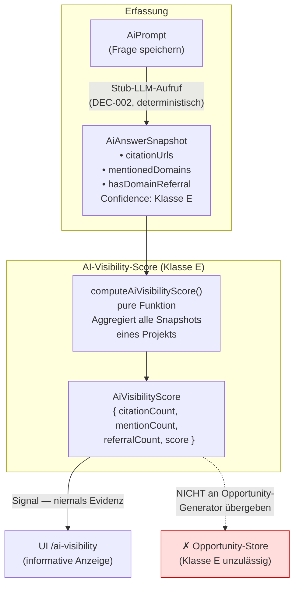
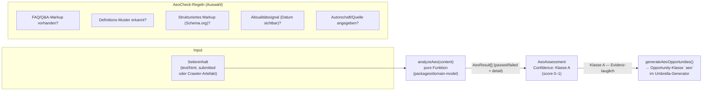
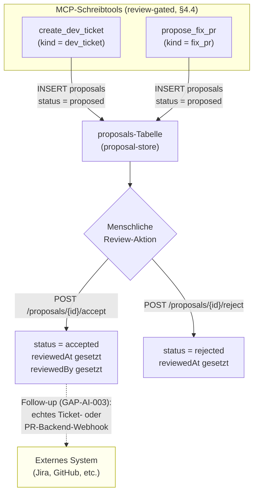

# AI Layer & AEO — Architektur (M6 / Welle 7)

> **Status: IMPLEMENTIERT — M6 abgeschlossen.**
> Zweck: Architektur-Dokumentation des AI-Visibility-Moduls (Prompt/Citation/Mention/Referral-Tracking,
> AI-Visibility-Score, AEO-Checks) und der review-gepflichteten MCP-Schreibtools (Proposals-Lifecycle).
> Verknüpft mit `tasks/_archive/phase1-summary.md` (Phase-1-Abschluss, M6 Welle 7).
>
> Stand: 2026-06-06 · Confidence-Klassen gemäß `docs/PRODUCT_MASTER_SPEC.md` §2.7 · DEC-002 aktiv.

---

## 1. Zweck und Abgrenzung

Das AI-Layer-Modul beantwortet die Frage: **Wie präsent ist unsere Domain in KI-generierten Antworten,
und erfüllen unsere Inhalte die strukturellen Voraussetzungen, um von KI-Systemen zitiert zu werden?**

Kernlieferung:
- **AI-Visibility-Tracking** — Prompts werden gespeichert, LLM-Antwort-Snapshots deterministisch
  erfasst (Stub, DEC-002), Citations/Mentions/Referrals daraus extrahiert und zu einem
  `AiVisibilityScore` verdichtet. Alle LLM-abgeleiteten Werte tragen **Confidence-Klasse E** und
  sind ausschließlich Signale — sie dienen nie als Opportunity-Evidenz.
- **AEO-Checks (Answer Engine Optimization)** — content- und crawl-basierte Prüfung, ob Seiten
  strukturell LLM-Citation-tauglich sind (strukturiertes Markup, FAQ/Definition-Muster, Autorität,
  Aktualität). AEO-Assessments sind Klasse-A-Evidenz und speisen die sechste harte Opportunity-Klasse
  `aeo`.
- **Review-gated MCP-Schreibtools** — `create_dev_ticket` und `propose_fix_pr` erzeugen
  `proposals`-Einträge im Status `proposed`. Jede Zeile wartet auf menschliche Annahme oder
  Ablehnung — keine direkte Produktionsmutation.
- **Proposals-Lifecycle** — Proposal-Einträge durchlaufen `proposed → accepted | rejected`
  ausschließlich durch explizite menschliche Review-Aktion.

Bewusst außerhalb des Scopes: echter LLM-Provider statt deterministischem Stub (GAP-AI-001),
crawler-gelieferter Seiteninhalt für AEO statt selbst eingereichtem (GAP-AI-002), echte
Ticket-/PR-Backend-Anbindung hinter MCP-Schreibtools (GAP-AI-003).

---

## 2. Confidence-Klassen-Firewall

> **Zentraler Designpunkt — lesen vor allem anderen.**

Das Modul arbeitet mit zwei klar getrennten Confidence-Klassen, die unterschiedliche Datenquellen
repräsentieren und unterschiedliche Rollen im Opportunity-System spielen:

| Quelle | Klasse | Evidenz-tauglich? | Begründung |
|---|---|---|---|
| LLM-Antwort-Snapshots (Stub, DEC-002) | **E** | **Nein** — reines Signal | Gemäß §2.3 und §2.7 des Master-Specs ist Klasse E niemals als Opportunity-Evidenz akzeptabel. LLM-Output ist nicht deterministisch verifizierbar; der aktuelle Stub ist überdies ein Platzhalter (DEC-002). |
| `AiVisibilityScore` (aus Klasse-E-Snapshots) | **E** | **Nein** — abgeleitetes Signal | Score aggregiert ausschließlich Klasse-E-Quellen; erbt deren Einschränkung. |
| AEO-Assessments (`aeo_assessments`) | **A** | **Ja** — speist Opportunity-Klasse `aeo` | Basieren auf direktem Seiteninhalt und Crawl-Artefakten (deterministisch, reproduzierbar). |

```
┌─────────────────────────────────────────────────────────────────┐
│                    Confidence-Firewall                          │
│                                                                 │
│  LLM-Snapshots  ──Klasse E──►  AiVisibilityScore               │
│  (DEC-002 Stub)               (Signal, nie Evidenz)            │
│                                        │                        │
│                              wird NICHT an Opportunity-         │
│                              Generator übergeben                │
│                                                                 │
│  AEO-Assessments ──Klasse A──►  generateAeoOpportunities()     │
│  (Inhalt + Crawl)               → Opportunity-Klasse `aeo`     │
└─────────────────────────────────────────────────────────────────┘
```

**Konsequenz für den Umbrella-Generator:** `generateAeoOpportunities` wird in den bestehenden
Opportunity-Umbrella-Generator eingebunden. Es werden ausschließlich `aeo_assessments`-Zeilen
(Klasse A) als Evidenz herangezogen. Der `AiVisibilityScore` fließt nicht in Opportunity-Scores ein —
er ist ein separates, ausschließlich informatives Signal in der UI.

---

## 3. Domain-Modell (`packages/domain-model/src/`)

### 3.1 AI-Visibility (`ai-visibility.ts`)

| Typ | Felder | Zweck |
|---|---|---|
| `AiPrompt` | `id`, `projectId`, `promptText`, `topic`, `createdAt` | Gespeicherte SEO-Frage, für die LLM-Sichtbarkeit verfolgt wird |
| `AiAnswerSnapshot` | `id`, `promptId`, `projectId`, `snapshotAt`, `answerText`, `citationUrls`, `mentionedDomains`, `hasDomainReferral` | Deterministisch erfasste LLM-Antwort zu einem Zeitpunkt (Klasse E, DEC-002) |
| `AiVisibilityScore` | `projectId`, `computedAt`, `citationCount`, `mentionCount`, `referralCount`, `score` | Verdichteter Score über alle Snapshots eines Projekts (Klasse E) |
| `computeAiVisibilityScore(snapshots)` | pure Funktion | Aggregiert Citations, Mentions, Referrals; gibt `AiVisibilityScore` zurück |

### 3.2 AEO (`aeo.ts`)

| Typ | Felder | Zweck |
|---|---|---|
| `AeoCheck` | `id`, `name`, `description`, `weight` | Einzelne strukturelle Prüfregel (z. B. FAQ-Markup vorhanden, Definitions-Muster, Aktualitätssignal) |
| `AeoResult` | `checkId`, `passed`, `detail` | Ergebnis einer einzelnen Prüfregel für eine URL |
| `AeoAssessment` | `id`, `projectId`, `url`, `assessedAt`, `results: AeoResult[]`, `score`, `confidence` | Vollständige Bewertung einer URL über alle Checks (Klasse A) |
| `analyzeAeo(content)` | pure Funktion | Führt alle `AeoCheck`-Regeln auf dem übergebenen Seiteninhalt aus; gibt `AeoResult[]` zurück |

### 3.3 Proposals (`proposals.ts`)

| Typ | Felder | Zweck |
|---|---|---|
| `ProposalKind` | `'dev_ticket' \| 'fix_pr'` | Herkunftsklasse des Vorschlags |
| `ProposalStatus` | `'proposed' \| 'accepted' \| 'rejected'` | Aktueller Review-Zustand |
| `Proposal` | `id`, `projectId`, `kind`, `status`, `title`, `body`, `sourceOpportunityId?`, `createdAt`, `reviewedAt?`, `reviewedBy?` | Reviewpflichtiger Vorschlag aus MCP-Schreibtool |

---

## 4. Datenbankschema (Migration `012_ai_aeo.sql`)

```
ai_prompts
  id           TEXT PK
  project_id   TEXT FK
  prompt_text  TEXT
  topic        TEXT
  created_at   TEXT        ← ISO-8601-Timestamp

ai_answer_snapshots
  id                  TEXT PK
  prompt_id           TEXT FK → ai_prompts.id
  project_id          TEXT FK
  snapshot_at         TEXT        ← ISO-8601-Timestamp
  answer_text         TEXT
  citation_urls       TEXT        ← JSON-Array
  mentioned_domains   TEXT        ← JSON-Array
  has_domain_referral INTEGER (0/1)

aeo_assessments
  id           TEXT PK
  project_id   TEXT FK
  url          TEXT
  assessed_at  TEXT        ← ISO-8601-Timestamp
  results      TEXT        ← JSON-serialisierte AeoResult[]
  score        REAL        ← 0–1
  confidence   TEXT        ← 'A'

proposals
  id                    TEXT PK
  project_id            TEXT FK
  kind                  TEXT        ← 'dev_ticket' | 'fix_pr'
  status                TEXT        ← 'proposed' | 'accepted' | 'rejected'
  title                 TEXT
  body                  TEXT
  source_opportunity_id TEXT        ← FK → opportunities.id (optional)
  created_at            TEXT
  reviewed_at           TEXT
  reviewed_by           TEXT
```

---

## 5. AI-Visibility-Tracking (Prompts → Snapshots → Score)



**Snapshot-Semantik:** Jeder `AiAnswerSnapshot` ist der deterministisch erfasste Zustand der
LLM-Antwort zu einem konkreten Zeitpunkt. Solange DEC-002 offen ist, nutzt der Stub eine
reproduzierbare Antwort auf Basis des Prompt-Hashes; ein echter LLM-Provider ersetzt den Stub
ohne Schemaänderung (GAP-AI-001).

---

## 6. AEO-Check-Modell



**Klasse-A-Garantie:** `analyzeAeo` wertet ausschließlich den übergebenen Seiteninhalt aus —
keine externen API-Aufrufe, keine Zufallskomponente. Das Ergebnis ist für denselben Input
jederzeit reproduzierbar und damit als Klasse-A-Evidenz zugelassen.

**sechste harte Opportunity-Klasse:** `aeo`-Opportunities schließen die Lücke im Opportunity-
Rückgrat (bisher fünf harte Klassen aus M3). Eine `aeo`-Opportunity entsteht, wenn
`AeoAssessment.score` unter einem definierten Schwellenwert liegt und mindestens ein
`AeoResult.passed = false` eine korrigierbare strukturelle Lücke belegt.

---

## 7. Review-gated MCP-Schreibtools (Proposals-Lifecycle)

> **Alle Schreibvorgänge bleiben reviewbar.** MCP-Schreibtools erzeugen ausschließlich
> `proposals`-Zeilen im Status `proposed`. Eine direkte Produktionsmutation ist nicht möglich.



**Statusübergänge:**

| Von | Nach | Auslöser |
|---|---|---|
| `proposed` | `accepted` | `POST /proposals/{id}/accept` (menschliche Aktion) |
| `proposed` | `rejected` | `POST /proposals/{id}/reject` (menschliche Aktion) |

Kein Übergang ist maschinell-autonom. Das MCP-Tool darf ausschließlich in den Zustand `proposed`
schreiben; alle weiteren Übergänge erfordern einen authentifizierten HTTP-Aufruf.

**Begründung (§4.4 Master-Spec):** Schreibende Agent-Aktionen auf Produktionsdaten sind erst
zulässig, wenn ein Review-Gate vorhanden ist. Das Proposals-Muster implementiert dieses Gate
für alle MCP-generierten Vorschläge.

---

## 8. Stores

### 8.1 `ai-store.ts`

| Funktion | Verhalten |
|---|---|
| `createAiPrompt(projectId, promptText, topic)` | Neuen Prompt persistieren |
| `listAiPrompts(projectId)` | Alle Prompts eines Projekts |
| `createAiAnswerSnapshot(promptId, projectId)` | Deterministischen LLM-Stub aufrufen; `AiAnswerSnapshot` persistieren (Klasse E) |
| `listAiAnswerSnapshots(promptId)` | Alle Snapshots eines Prompts |
| `getAiVisibilityScore(projectId)` | `computeAiVisibilityScore` über alle Snapshots; Ergebnis in der Antwort als Klasse E markiert |
| `runAeoScan(projectId, url, content)` | `analyzeAeo(content)` aufrufen; `AeoAssessment` persistieren (Klasse A) |
| `listAeoAssessments(projectId)` | Alle Assessments eines Projekts |

### 8.2 `proposal-store.ts`

| Funktion | Verhalten |
|---|---|
| `createProposal(projectId, kind, title, body, sourceOpportunityId?)` | Neuen Proposal im Status `proposed` anlegen |
| `listProposals(projectId, status?)` | Proposals auflisten; optional nach Status filtern |
| `acceptProposal(proposalId, reviewedBy)` | Status auf `accepted` setzen; `reviewed_at` und `reviewed_by` schreiben |
| `rejectProposal(proposalId, reviewedBy)` | Status auf `rejected` setzen; `reviewed_at` und `reviewed_by` schreiben |

### 8.3 Erweiterung `opportunity-store.ts`

| Funktion | Verhalten |
|---|---|
| `generateAeoOpportunities(projectId)` | Liest `aeo_assessments` mit Score unter Schwellenwert; erzeugt idempotent `aeo`-Opportunities mit Klasse-A-Evidenz; wird in den Umbrella-Generator `opportunities/generate` eingebunden |

---

## 9. API-Routen

### 9.1 AI-Prompts & Snapshots (`apps/api/src/routes/ai-prompts.ts`)

| Methode | Pfad | Beschreibung |
|---|---|---|
| `POST` | `/projects/{id}/ai-prompts` | Neuen Prompt anlegen |
| `GET` | `/projects/{id}/ai-prompts` | Alle Prompts eines Projekts |
| `POST` | `/ai-prompts/{promptId}/snapshots` | LLM-Stub-Snapshot erfassen |
| `GET` | `/ai-prompts/{promptId}/snapshots` | Snapshots eines Prompts |

### 9.2 AI-Visibility (`apps/api/src/routes/ai-visibility.ts`)

| Methode | Pfad | Beschreibung |
|---|---|---|
| `GET` | `/projects/{id}/ai-visibility` | `AiVisibilityScore` (Klasse E) abrufen |

### 9.3 AEO (`apps/api/src/routes/aeo.ts`)

| Methode | Pfad | Beschreibung |
|---|---|---|
| `POST` | `/projects/{id}/aeo/scan` | AEO-Scan für eine URL + Inhalt ausführen |
| `GET` | `/projects/{id}/aeo/assessments` | Alle Assessments des Projekts |

### 9.4 Proposals (`apps/api/src/routes/proposals.ts`)

| Methode | Pfad | Beschreibung |
|---|---|---|
| `POST` | `/projects/{id}/proposals` | Neuen Proposal anlegen (Status `proposed`) |
| `GET` | `/projects/{id}/proposals` | Proposals auflisten (filter: `status`) |
| `POST` | `/proposals/{id}/accept` | Proposal annehmen (menschliche Review-Aktion) |
| `POST` | `/proposals/{id}/reject` | Proposal ablehnen (menschliche Review-Aktion) |

---

## 10. MCP-Tools (`services/mcp`)

| Tool | Art | Beschreibung |
|---|---|---|
| `get_ai_visibility` | read-only | `AiVisibilityScore` (Klasse E) für ein Projekt abrufen |
| `list_proposals` | read-only | Proposals eines Projekts auflisten; optional nach Status filtern |
| `create_dev_ticket` | **write (review-gated)** | Proposal `kind = dev_ticket` im Status `proposed` erzeugen |
| `propose_fix_pr` | **write (review-gated)** | Proposal `kind = fix_pr` im Status `proposed` erzeugen |

Schreibtools (`create_dev_ticket`, `propose_fix_pr`) dürfen ausschließlich `proposals`-Zeilen
im Status `proposed` erzeugen. Sie dürfen keine anderen Tabellen beschreiben und keinen
Statusübergang auslösen. Dieser Grundsatz ist im MCP-Tool-Handler strukturell erzwungen, nicht
nur konventionell.

---

## 11. UI (`/ai-visibility`)

Die Seite `/ai-visibility` zeigt:
- Liste der gespeicherten Prompts mit Snapshot-Zähler
- Aktuellen `AiVisibilityScore` (als Klasse-E-Signal klar gekennzeichnet)
- AEO-Assessments mit Score und aufgeschlüsselten Check-Ergebnissen
- Proposals-Liste mit Status und Review-Aktionen (Annehmen / Ablehnen)

---

## 12. Confidence-Zusammenfassung

| Quelle / Metrik | Klasse | Verwendbar als Opportunity-Evidenz? |
|---|---|---|
| `AiAnswerSnapshot` (LLM-Stub, DEC-002) | **E** | Nein — nur informatives Signal |
| `AiVisibilityScore` | **E** | Nein — aggregiertes Signal |
| `AeoAssessment` (Inhalt/Crawl) | **A** | **Ja** — speist `aeo`-Opportunity-Klasse |
| `Proposal` | — | Vorschlag, kein Messwert |

Solange DEC-002 offen ist, bleibt AI-Visibility ein Monitoring-Signal ohne
Opportunity-Relevanz. AEO-basierte Opportunities sind davon unabhängig voll funktionsfähig,
weil sie ausschließlich auf Klasse-A-Evidenz aufbauen.

---

## 13. Follow-ups / GAP

| ID | Bereich | Befund | Empfehlung |
|---|---|---|---|
| GAP-AI-001 | AI-Visibility / Provider | LLM-Antwort-Snapshots nutzen einen deterministischen Stub (DEC-002 offen); kein echter LLM-API-Aufruf | Echten LLM-Provider hinter der `createAiAnswerSnapshot`-Abstraktion einbinden (z. B. Anthropic Claude API oder Open-Source-Modell); Confidence bleibt Klasse E; Stub gegen echten Connector austauschen ohne Schemaänderung |
| GAP-AI-002 | AEO / Content-Quelle | `analyzeAeo` erhält aktuell vom API-Caller eingereichtem Seiteninhalt; Crawler liefert Inhalte noch nicht automatisch | Crawler-Artefakte (`fetch_results.body`) als primäre Content-Quelle an `runAeoScan` übergeben; Scan dann als regulären Worker-Job nach jedem Crawl-Zyklus ausführen; manuelle Einreichung als Fallback behalten |
| GAP-AI-003 | MCP-Schreibtools / Backend | `create_dev_ticket` und `propose_fix_pr` erzeugen nur Datenbankzeilen; kein echter Webhook an Ticketing- oder PR-System | Echten Integrations-Adapter (z. B. GitHub-Issues-API, Jira-REST, Linear) hinter `acceptProposal` einbinden; erst nach Annahme durch Review wird das externe System benachrichtigt; Proposal bleibt primäre Review-Instanz |
