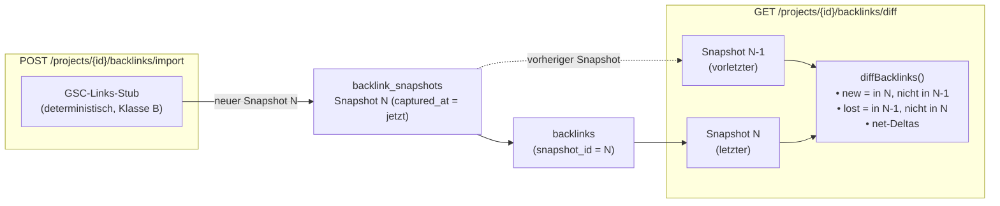

# Authority & Backlinks — Architektur (M4 / Welle 5)

> **Status: IMPLEMENTIERT — M4 abgeschlossen.**
> Zweck: Architektur-Dokumentation des Authority-Moduls (GSC-Link-Import, Referring-Domain-Modell,
> New/Lost-Diff zwischen Snapshots, Authority-Intelligence, UI und read-only MCP-Tools).
> Verknüpft mit `tasks/_archive/phase1-summary.md` (Phase-1-Abschluss, M4 Welle 5).
>
> Stand: 2026-06-06 · Confidence-Klassen gemäß `docs/PRODUCT_MASTER_SPEC.md` §2.7 · DEC-002 aktiv.

---

## 1. Zweck und Abgrenzung

Das Authority-Modul beantwortet die Frage: **Wer verlinkt auf unsere Domain, wie hat sich das
verändert, und wie stark ist das Linkprofil insgesamt?**

Kernlieferung:
- **Deterministische Import-Stubs** (GSC-Links, Confidence-Klasse B, DEC-002) — kein lizenzierter
  Drittanbieter in dieser Welle; der Stub erzeugt pro Snapshot-Runde neue/veränderte Daten, damit
  der New/Lost-Diff real nachvollziehbar bleibt.
- **Snapshot-basiertes Diff-Modell** — jeder Import erzeugt einen Snapshot; New/Lost ergibt sich
  aus dem Vergleich des letzten mit dem vorletzten Snapshot.
- **Authority-Intelligence** — aggregierte Metriken (Follow-Ratio, Top-Referring-Domains, Top-Anchors,
  Top-Target-URLs) als lesbare Zusammenfassung.
- **Read-only MCP-Tools** — Agent-Zugriff ohne Schreibrechte.

Bewusst außerhalb des Scopes: echte GSC-OAuth-Anbindung (DEC-002 offen), Drittanbieter-Backlink-Quellen
(Klasse D), Competitor-Gap-Analyse (kein fremdes Linkprofil in dieser Welle).

---

## 2. Datenmodell

### 2.1 Domain-Typen (`packages/domain-model/src/backlinks.ts`)

| Typ | Felder | Zweck |
|---|---|---|
| `Backlink` | `id`, `snapshotId`, `sourceUrl`, `sourceDomain`, `targetUrl`, `anchorText`, `isFollow`, `firstSeen`, `lastSeen` | Ein einzelner eingehender Link aus einem Snapshot |
| `ReferringDomain` | `sourceDomain`, `backlinkCount`, `followCount`, `firstSeen`, `lastSeen` | Aggregation aller Backlinks einer Quell-Domain |
| `BacklinkSnapshot` | `id`, `projectId`, `capturedAt`, `backlinkCount`, `referringDomainCount` | Metadaten eines Import-Laufs |
| `BacklinkDiff` | `newBacklinks`, `lostBacklinks`, `newReferringDomains`, `lostReferringDomains`, `netBacklinkDelta`, `netReferringDomainDelta` | Ergebnis des Snapshot-Diffs |
| `AuthoritySummary` | `followRatio`, `topReferringDomains`, `topAnchors`, `topTargetUrls`, `totalBacklinks`, `totalReferringDomains` | Verdichtete Lageübersicht |

### 2.2 Identitätsregeln für den Diff

- **Backlink-Identität:** `sourceUrl + targetUrl` — ein Link gilt als "gleich", wenn URL-Paar übereinstimmt.
- **Domain-Identität:** `sourceDomain` — registrierbare Domain (eTLD+1), nicht der volle Hostname.

### 2.3 Datenbankschema (Migration `010_backlinks.sql`)

```
backlink_snapshots
  id          TEXT PK
  project_id  TEXT FK
  captured_at TEXT    ← ISO-8601-Timestamp; "aktuell" = größtes captured_at je Projekt
  backlink_count          INTEGER
  referring_domain_count  INTEGER

backlinks
  id            TEXT PK
  snapshot_id   TEXT FK → backlink_snapshots.id
  source_url    TEXT
  source_domain TEXT
  target_url    TEXT
  anchor_text   TEXT
  is_follow     INTEGER (0/1)
  first_seen    TEXT
  last_seen     TEXT
```

Jeder Import-Aufruf legt einen neuen Snapshot-Eintrag an und schreibt alle zugehörigen Backlinks mit
dessen `snapshot_id`. Der aktuelle Stand ist immer der Snapshot mit dem größten `captured_at`.

---

## 3. Snapshot-Diff-Modell (New/Lost)



**Reihenfolge beim Import:**

1. Stub erzeugt einen Satz Backlinks (variiert leicht pro Runde, damit Diffs entstehen).
2. `importBacklinks` legt einen neuen `backlink_snapshots`-Eintrag mit aktuellem Timestamp an.
3. Alle Backlinks werden mit der neuen `snapshot_id` persistiert.
4. Beim Abrufen von `/backlinks/diff` ermittelt `backlinkDiff()` den letzten und vorletzten Snapshot
   und führt `diffBacklinks()` aus — rein auf DB-Ebene, ohne externe Abhängigkeit.

---

## 4. Authority-Intelligence

Die pure Funktion `summarizeAuthority` berechnet aus einer Liste von `Backlink`-Objekten:

| Metrik | Definition |
|---|---|
| `followRatio` | Anteil der `isFollow = true`-Links an allen Backlinks (0–1) |
| `topReferringDomains` | Top-N-Domains nach Backlink-Anzahl (aggregiert via `aggregateReferringDomains`) |
| `topAnchors` | Häufigste Anchor-Texte absteigend nach Vorkommen |
| `topTargetUrls` | Meistverlinkte eigene URLs |
| `totalBacklinks` | Gesamtzahl der Backlinks im letzten Snapshot |
| `totalReferringDomains` | Anzahl eindeutiger Quell-Domains im letzten Snapshot |

Diese Metriken werden serverseitig im Store (`authoritySummary`) berechnet und über
`GET /projects/{id}/authority` ausgeliefert.

---

## 5. API-Routen (`apps/api/src/routes/backlinks.ts`)

| Methode | Pfad | Beschreibung |
|---|---|---|
| `POST` | `/projects/{id}/backlinks/import` | Neuen Snapshot importieren (GSC-Stub) |
| `GET` | `/projects/{id}/backlinks` | Alle Backlinks des letzten Snapshots |
| `GET` | `/projects/{id}/referring-domains` | Aggregierte Referring-Domains |
| `GET` | `/projects/{id}/backlinks/diff` | New/Lost-Diff (letzter vs. vorletzter Snapshot) |
| `GET` | `/projects/{id}/authority` | `AuthoritySummary` des letzten Snapshots |
| `GET` | `/projects/{id}/backlink-snapshots` | Liste aller Snapshots (Metadaten) |

---

## 6. Store (`apps/api/src/stores/backlink-store.ts`)

| Funktion | Verhalten |
|---|---|
| `importBacklinks(projectId)` | Erzeugt deterministischen GSC-Stub, legt Snapshot an, persistiert Backlinks |
| `listBacklinks(projectId)` | Backlinks des aktuellen (letzten) Snapshots |
| `listReferringDomains(projectId)` | Aggregation via `aggregateReferringDomains` über letzten Snapshot |
| `backlinkDiff(projectId)` | Letzter vs. vorletzter Snapshot → `diffBacklinks()` |
| `authoritySummary(projectId)` | Letzter Snapshot → `summarizeAuthority()` |
| `listBacklinkSnapshots(projectId)` | Alle Snapshot-Metadaten aufsteigend nach `captured_at` |

Der Stub **variiert seinen Output je Snapshot-Runde** (z. B. fügt neue Links hinzu, entfernt andere),
damit der New/Lost-Diff nach zwei aufeinanderfolgenden Importen echte Einträge enthält und das Gate
„neue/verlorene Links nachvollziehbar" beweisbar ist.

---

## 7. Confidence-Klassen und Datenannahmen

| Quelle | Klasse | Begründung |
|---|---|---|
| GSC-Links (Stub) | **B** | Deterministischer Stub auf Basis des GSC-Connector-Interfaces (WP-0.4); echte OAuth-Anbindung fehlt (DEC-002) |
| Drittanbieter-Backlink-APIs (Ahrefs, Moz, Majestic …) | **D** | Lizenzierter Datenlieferant; kein Vertrag vorhanden; Datengüte und Abdeckung nicht verifiziert |

Gemäß §2.7 des Master-Specs müssen alle Metriken ihre Confidence-Klasse tragen. Die API-Antworten
und MCP-Tool-Outputs markieren GSC-abgeleitete Backlink-Daten entsprechend als Klasse B.

---

## 8. UI und MCP

**UI (`/backlinks`):** Zeigt Authority-Zusammenfassung, Referring-Domains-Tabelle, Backlink-Liste
und New/Lost-Diff (letzter vs. vorletzter Snapshot) in einer gemeinsamen Ansicht. Import-Button
löst `POST .../backlinks/import` aus und lädt die Ansicht neu.

**Read-only MCP-Tools** (`services/mcp`):

| Tool | Beschreibung |
|---|---|
| `get_authority_summary` | Liefert `AuthoritySummary` für ein Projekt |
| `list_referring_domains` | Paginierte Referring-Domain-Liste |
| `get_backlink_changes` | New/Lost-Diff aus `backlinkDiff()` |

Alle drei Tools sind lesend; Schreibzugriff (Import triggern) ist kein MCP-Tool — konsistent mit dem
Grundsatz „MCP = read-only" aus M3.

---

## 9. Follow-ups / GAP

| ID | Bereich | Befund | Empfehlung |
|---|---|---|---|
| GAP-AUTH-001 | Provider | GSC-Stub statt echter OAuth-Anbindung (DEC-002 offen) | Echten GSC-OAuth-Flow implementieren (refresh token, quota, normalisierte Links); Stub dann gegen echten Connector austauschen; Confidence bleibt B |
| GAP-AUTH-002 | Drittanbieter-Quellen | Ahrefs/Moz/Majestic nicht angebunden (Klasse D) | Erst wenn ein Lizenzvertrag vorliegt; Klasse D explizit kommunizieren; separater Provider-Adapter hinter dem Connector-Interface (§4.2) |
| GAP-AUTH-003 | Competitor-Gap | Eigenes Linkprofil vorhanden; Vergleich mit Wettbewerber-Domains fehlt | Authority-Gap-Analyse als spätere Erweiterung (M6+); setzt fremde Backlink-Daten voraus (GAP-AUTH-002) |
| GAP-AUTH-004 | Historische Tiefe | Stub-Snapshots decken nur die laufende Session ab | Mit echtem GSC-Provider historische Daten (bis 16 Monate) nachladen; Snapshot-Schema ist bereits kompatibel |
