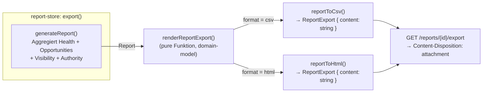
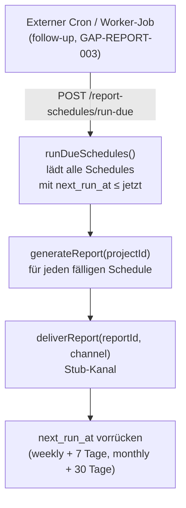
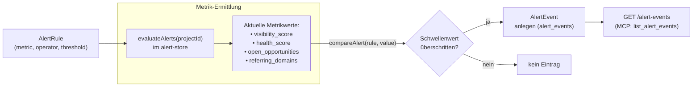

# Reporting & Alerts — Architektur (M5 / Welle 6)

> **Status: IMPLEMENTIERT — M5 abgeschlossen.**
> Zweck: Architektur-Dokumentation des Reporting- und Alert-Moduls (generisches Report-Abschnittsmodell,
> Export-Pipeline CSV/HTML, Delivery-Stub-Abstraktion, Schedule/Automatisierungsmodell und Alert-Regel→Ereignis-Flow).
> Verknüpft mit `tasks/roadmap-tracking.md` (M5 Welle 6) und `tasks/codex-execution-plan.md`.
>
> Stand: 2026-06-06 · Confidence-Klassen gemäß `docs/PRODUCT_MASTER_SPEC.md` §2.7 · DEC-002 aktiv.

---

## 1. Zweck und Abgrenzung

Das Reporting-Modul beantwortet die Frage: **Wie entwickeln sich unsere SEO-Metriken über die Zeit, und
wann überschreiten sie kritische Schwellenwerte?**

Kernlieferung:
- **Generisches Report-Abschnittsmodell** — ein Report besteht aus typisierten `ReportSection`-Objekten,
  die Daten aus den vier bestehenden Modulen (Health, Opportunities, Visibility, Authority) aggregieren.
- **Export-Pipeline CSV/HTML** — dependency-freie reine Funktionen (`reportToCsv`, `reportToHtml`,
  `renderReportExport`) konvertieren jeden Report direkt aus dem Domain-Modell heraus.
- **Delivery-Stub-Abstraktion** — Email- und Slack-Kanäle sind als deterministische Stubs implementiert
  (DEC-002 offen); die Kanalabstraktion erlaubt späteres Austauschen gegen echte Provider.
- **Schedule/Automatisierungsmodell** — `ReportSchedule`-Einträge werden durch einen externen
  Worker/Cron über `runDueSchedules` abgearbeitet (idempotent, ein Aufruf erledigt alle fälligen
  Schedules).
- **Alert-Regel→Ereignis-Modell** — `AlertRule`-Definitionen mit Schwellenwerten werden durch
  `evaluateAlerts` gegen aktuelle Metrikwerte ausgewertet; erkannte Verstöße erzeugen `AlertEvent`-
  Einträge.
- **Read-only MCP-Tools** — `get_latest_report` und `list_alert_events` ermöglichen Agent-Zugriff
  ohne Schreibrechte.

Bewusst außerhalb des Scopes: echter PDF-Renderer (GAP-REPORT-001), echte SMTP/Slack-Delivery
(GAP-REPORT-002), worker-getriebener Cron-Scheduler in der Laufzeitumgebung (GAP-REPORT-003).

---

## 2. Domain-Modell (`packages/domain-model/src/`)

### 2.1 Report-Typen (`reports.ts`)

| Typ | Felder | Zweck |
|---|---|---|
| `ReportSection` | `type`, `title`, `data` (generisch) | Einzelner inhaltlicher Block eines Reports (Health, Opportunities, Visibility, Authority) |
| `Report` | `id`, `projectId`, `generatedAt`, `sections: ReportSection[]` | Vollständiger aggregierter Report zu einem Zeitpunkt |
| `ReportDelivery` | `id`, `reportId`, `channel` (`email`\|`slack`), `deliveredAt`, `status`, `payload` | Protokolleintrag eines Zustellversuchs |
| `ReportSchedule` | `id`, `projectId`, `cadence` (`weekly`\|`monthly`), `nextRunAt`, `channel`, `enabled` | Automatisierungsregel für wiederkehrende Reports |
| `ReportExport` | `reportId`, `format` (`csv`\|`html`), `content` | Serialisierter Report für den Download |

### 2.2 Alert-Typen (`alerts.ts`)

| Typ | Felder | Zweck |
|---|---|---|
| `AlertRule` | `id`, `projectId`, `metric` (`visibility_score`\|`health_score`\|`open_opportunities`\|`referring_domains`), `operator` (`lt`\|`gt`\|`lte`\|`gte`), `threshold`, `enabled` | Schwellenwertdefinition für eine Metrik |
| `AlertEvent` | `id`, `ruleId`, `projectId`, `metric`, `currentValue`, `threshold`, `triggeredAt` | Protokolleintrag eines ausgelösten Alerts |

### 2.3 Pure Exportfunktionen (`reports.ts`)

| Funktion | Verhalten |
|---|---|
| `reportToCsv(report)` | Serialisiert alle Sections als CSV-Zeilen (kein externer Parser) |
| `reportToHtml(report)` | Erzeugt einfaches HTML-Dokument ohne externe Template-Bibliothek |
| `renderReportExport(report, format)` | Delegiert an `reportToCsv` oder `reportToHtml`; erzeugt `ReportExport` |
| `compareAlert(rule, currentValue)` | Vergleicht Metrikwert gegen Schwellenwert gemäß Operator; gibt `boolean` zurück |

Alle Exportfunktionen sind **dependency-frei** (keine npm-Abhängigkeiten, keine I/O) und damit isoliert
testbar. Der Aufruf von `renderReportExport` genügt als einziger Einstiegspunkt für den Download-Pfad.

---

## 3. Datenbankschema (Migration `011_reporting.sql`)

```
reports
  id            TEXT PK
  project_id    TEXT FK
  generated_at  TEXT        ← ISO-8601-Timestamp
  sections      TEXT        ← JSON-serialisierte ReportSection[]

report_deliveries
  id            TEXT PK
  report_id     TEXT FK → reports.id
  channel       TEXT        ← 'email' | 'slack'
  delivered_at  TEXT
  status        TEXT        ← 'sent' | 'failed'
  payload       TEXT        ← JSON (Stub-Kanal-Antwort)

report_schedules
  id            TEXT PK
  project_id    TEXT FK
  cadence       TEXT        ← 'weekly' | 'monthly'
  next_run_at   TEXT        ← ISO-8601; wird nach jedem Lauf vorgerückt
  channel       TEXT
  enabled       INTEGER (0/1)

alert_rules
  id            TEXT PK
  project_id    TEXT FK
  metric        TEXT        ← 'visibility_score' | 'health_score' | 'open_opportunities' | 'referring_domains'
  operator      TEXT        ← 'lt' | 'gt' | 'lte' | 'gte'
  threshold     REAL
  enabled       INTEGER (0/1)

alert_events
  id            TEXT PK
  rule_id       TEXT FK → alert_rules.id
  project_id    TEXT FK
  metric        TEXT
  current_value REAL
  threshold     REAL
  triggered_at  TEXT
```

---

## 4. Export-Pipeline (CSV / HTML)



Das Format `pdf` ist bewusst **nicht** implementiert (GAP-REPORT-001). Der Download-Endpunkt setzt
den Response-Header `Content-Disposition: attachment` und gibt den serialisierten String direkt zurück.
Die Datenbankschicht speichert Reports als JSON in der `sections`-Spalte; der Export erfolgt on-the-fly
ohne erneute Aggregation.

---

## 5. Delivery-Stub-Abstraktion

Beide Kanäle (`email`, `slack`) sind als **deterministische Stubs** implementiert (DEC-002). Ein
Zustellversuch über `deliverReport` schreibt immer einen `report_deliveries`-Eintrag mit `status = 'sent'`
und einem Stub-Payload — es findet keine echte Netzwerk-Kommunikation statt.

**Kanalabstraktion:** Die Store-Funktion `deliverReport(reportId, channel)` ist kanalunabhängig gehalten.
Zukünftige Provider (echter SMTP-Adapter, Slack-Webhook-Adapter) können hinter dieser Signatur eingehängt
werden, ohne die Route oder das Domain-Modell zu ändern. Die Entscheidung, welcher Provider aktiv ist,
obliegt dem Connector-Interface (§4.2 Master-Spec, DEC-002).

---

## 6. Schedule- und Automatisierungsmodell

**Voraussetzung:** Ein In-Environment-Cron-Scheduler (z. B. Vercel Cron) steht in der aktuellen
Laufzeitumgebung nicht zur Verfügung (GAP-REPORT-003). Das Gate „Wochenreport automatisiert" ist
deshalb so definiert:

> Ein **idempotenter API-Aufruf** (`POST /report-schedules/run-due`) führt alle fälligen `ReportSchedule`-
> Einträge aus und rückt deren `next_run_at` vor. Dieser Aufruf wird von einem externen Worker oder
> einem infrastrukturellen Cron-Trigger (follow-up) ausgelöst.



**Idempotenz:** Mehrfachaufrufe innerhalb derselben Minute sind sicher — `next_run_at` wird unmittelbar
nach dem ersten Lauf vorgerückt, sodass ein erneuter Aufruf keine doppelten Reports erzeugt.

---

## 7. Alert-Regel → Ereignis-Modell



**Metrik-Ermittlung:** `evaluateAlerts` liest die aktuellen Werte direkt aus den bestehenden Modulen
(Health-Score aus `health_scores`, Opportunities-Zähler aus `opportunities`, Visibility-Score aus
`visibility_index`, Referring-Domains-Zähler aus `backlink_snapshots`) — keine eigene Berechnungslogik,
nur Aggregation vorhandener Quellen.

**Confidence-Transitivität:** Alert-Events erben die Confidence-Klasse ihrer Quellmetrik. Ein Alert
auf `visibility_score` trägt damit automatisch Klasse B (deterministischer SERP-Stub, DEC-002);
ein Alert auf `health_score` trägt Klasse B (PSI-Connector-Stub).

---

## 8. API-Routen

### 8.1 Reports (`apps/api/src/routes/reports.ts`)

| Methode | Pfad | Beschreibung |
|---|---|---|
| `POST` | `/projects/{id}/reports/generate` | Neuen Report aggregieren und persistieren |
| `GET` | `/projects/{id}/reports` | Alle Reports des Projekts auflisten |
| `GET` | `/projects/{id}/reports/latest` | Letzten Report abrufen |
| `GET` | `/reports/{reportId}` | Einzelnen Report abrufen |
| `GET` | `/reports/{reportId}/export` | Export als CSV oder HTML (Query-Param `format`) |
| `POST` | `/reports/{reportId}/deliver` | Zustellung an Kanal auslösen (Stub) |
| `GET` | `/reports/{reportId}/deliveries` | Zustellhistorie eines Reports |
| `POST` | `/projects/{id}/report-schedules` | Neuen Schedule anlegen |
| `GET` | `/projects/{id}/report-schedules` | Schedules eines Projekts auflisten |
| `POST` | `/report-schedules/run-due` | Alle fälligen Schedules ausführen (Cron-Gate) |

### 8.2 Alerts (`apps/api/src/routes/alerts.ts`)

| Methode | Pfad | Beschreibung |
|---|---|---|
| `POST` | `/projects/{id}/alert-rules` | Neue AlertRule anlegen |
| `GET` | `/projects/{id}/alert-rules` | Alert-Regeln eines Projekts auflisten |
| `PUT` | `/alert-rules/{ruleId}` | Alert-Regel aktualisieren |
| `DELETE` | `/alert-rules/{ruleId}` | Alert-Regel löschen |
| `POST` | `/projects/{id}/alerts/evaluate` | Aktuelle Metriken auswerten, Events erzeugen |
| `GET` | `/projects/{id}/alert-events` | Alert-Events des Projekts auflisten |

---

## 9. Stores

### 9.1 `report-store.ts`

| Funktion | Verhalten |
|---|---|
| `generateReport(projectId)` | Aggregiert Health-, Opportunity-, Visibility- und Authority-Daten zu `ReportSection[]`; persistiert Report |
| `getReport(reportId)` | Einen Report abrufen |
| `listReports(projectId)` | Alle Reports eines Projekts |
| `exportReport(reportId, format)` | Ruft `renderReportExport` auf; gibt `ReportExport` zurück |
| `deliverReport(reportId, channel)` | Stub-Zustellung; schreibt `report_deliveries`-Eintrag |
| `listDeliveries(reportId)` | Zustellhistorie eines Reports |
| `createSchedule(projectId, cadence, channel)` | Neuen Schedule anlegen; setzt `next_run_at` auf jetzt + Kadenz |
| `listSchedules(projectId)` | Schedules eines Projekts |
| `runDueSchedules()` | Alle Schedules mit `next_run_at ≤ jetzt` generieren, zustellen und `next_run_at` vorrücken |

### 9.2 `alert-store.ts`

| Funktion | Verhalten |
|---|---|
| `createAlertRule(projectId, metric, operator, threshold)` | Neue Regel persistieren |
| `listAlertRules(projectId)` | Aktive Regeln auflisten |
| `updateAlertRule(ruleId, patch)` | Schwellenwert oder `enabled`-Flag anpassen |
| `deleteAlertRule(ruleId)` | Regel entfernen |
| `evaluateAlerts(projectId)` | Aktuelle Metrikwerte ermitteln, `compareAlert` anwenden, `alert_events` schreiben |
| `listAlertEvents(projectId)` | Alert-Events chronologisch absteigend |

---

## 10. UI und MCP

**UI (`/reports`):** Zeigt die Liste der generierten Reports, den letzten Report in Abschnittsansicht,
Export-Schaltflächen (CSV, HTML) und die Zustellhistorie. Alert-Regeln und -Events sind ebenfalls
über die `/reports`-Ansicht erreichbar.

**Read-only MCP-Tools** (`services/mcp`):

| Tool | Beschreibung |
|---|---|
| `get_latest_report` | Letzten aggregierten Report für ein Projekt abrufen |
| `list_alert_events` | Alert-Events eines Projekts auflisten (chronologisch absteigend) |

Beide Tools sind lesend, konsistent mit dem MCP-read-only-Grundsatz aus M3.

---

## 11. Confidence und Datenannahmen

Reports sind **abgeleitete Aggregate** — ihre Aussagekraft hängt von der Confidence der jeweiligen
Quellmodule ab:

| Quell-Metrik im Report | Confidence-Klasse | Begründung |
|---|---|---|
| `health_score` | **B** | PSI-Connector-Stub (WP-0.4/0.5, DEC-002) |
| `visibility_score` / Ranking | **B** | Deterministischer SERP-Provider-Stub (M2, DEC-002) |
| `open_opportunities` | **B** | Generatoren auf Basis von Stub-Quellen |
| `referring_domains` | **B** | GSC-Links-Stub (M4, DEC-002) |

Alert-Events und Report-Exports tragen dieselbe Confidence wie ihre Quellmetrik. Solange DEC-002
nicht durch echte Provider-Anbindungen aufgelöst ist, gilt für das gesamte Reporting-Modul **Klasse B**.

---

## 12. Follow-ups / GAP

| ID | Bereich | Befund | Empfehlung |
|---|---|---|---|
| GAP-REPORT-001 | Export / PDF | PDF-Export nicht implementiert; `renderReportExport` kennt nur CSV und HTML | Echten PDF-Renderer einbinden (z. B. Puppeteer/headless Chrome oder server-side PDF-Bibliothek); `ReportExport.format` um `pdf` erweitern; Achtung Paketgröße auf Serverless |
| GAP-REPORT-002 | Delivery / Provider | Email- und Slack-Zustellung sind Stubs (DEC-002 offen) | Echten SMTP-Adapter (z. B. Resend, Postmark) und Slack-Webhook-Adapter hinter `deliverReport`-Abstraktion einbauen; Confidence-Stufe der Delivery dann von B auf A anheben |
| GAP-REPORT-003 | Scheduling / Cron | `runDueSchedules` muss extern ausgelöst werden; kein In-Environment-Cron verfügbar | Worker-Job oder Vercel-Cron-Trigger einrichten, der `POST /report-schedules/run-due` periodisch aufruft (z. B. täglich, um wöchentliche und monatliche Schedules zu verarbeiten) |
