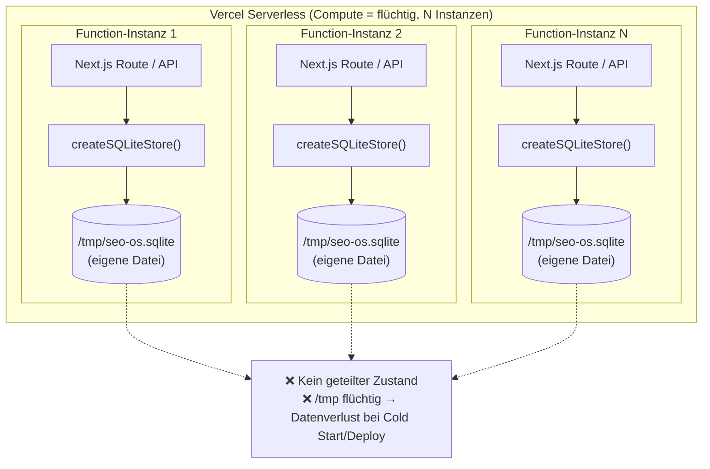
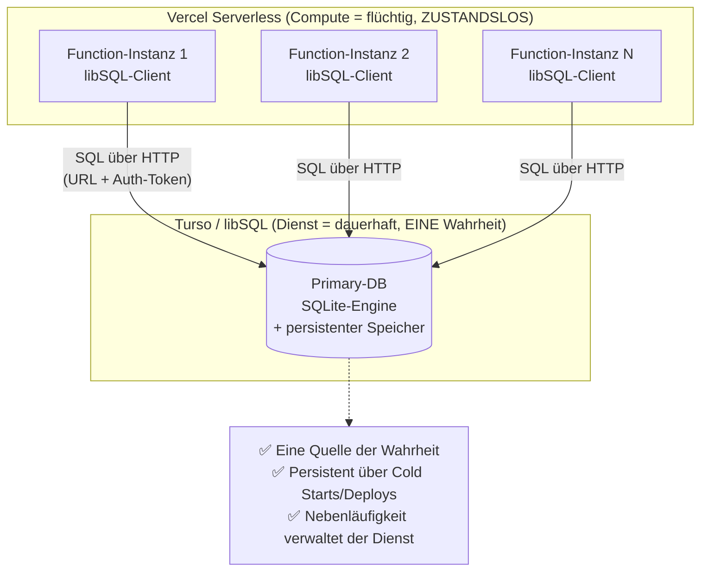
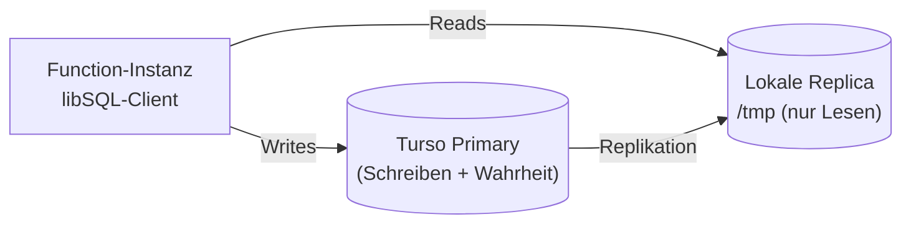
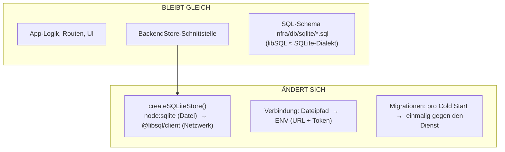
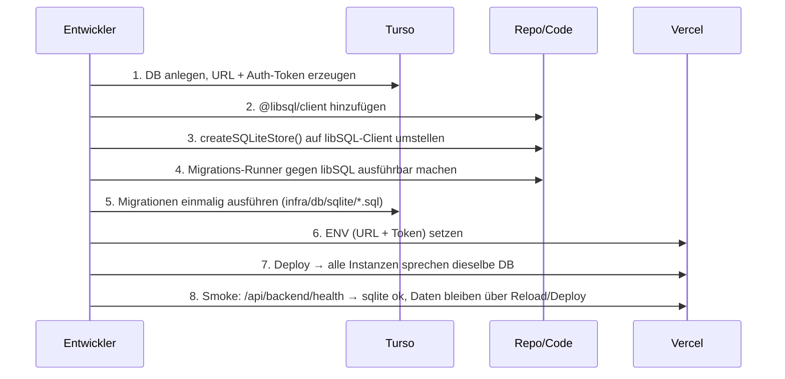

# Serverless-Persistenz: Migration von eingebettetem SQLite zu Turso/libSQL

> **Status: GEPLANT — ganz späteres Vorhaben (nicht im aktuellen Sprint).**
> Zweck: Skizze (Architektur + Umbauschritte), damit die Entscheidung dokumentiert ist.
> Es wird hier **nichts umgesetzt**. Verknüpft mit `../roadmap.md` (GAP-PERSIST-001, Hintergrund-Backlog)
> und `../../deployment/vercel-single-deployment.md` (Abschnitt Limitations).
>
> Stand: 2026-06-06

## 1. Problem in einem Satz

Auf Vercel ist jede Function-Instanz ein **kurzlebiger, isolierter Prozess mit eigenem `/tmp`**.
Das eingebettete SQLite (`node:sqlite`, lokale Datei) hat daher **keinen geteilten und keinen
dauerhaften Zustand**: parallele Instanzen sehen sich nicht, und beim Recyceln/Neudeploy gehen
Daten verloren. Das ist keine SQLite-Schwäche, sondern eine Folge von *Zustand im Compute-Prozess*.

## 2. Ist-Architektur (heute)



**Kernproblem:** Der Zustand liegt *in* jeder Compute-Instanz. Compute ist hier vervielfacht und flüchtig.

## 3. Ziel-Architektur (Option 1: Turso/libSQL)



**Prinzip:** Zustand wird aus dem Prozess herausgelöst und als **netzwerk-erreichbarer Dienst**
betrieben. Die App wird zustandslos und verbindet sich pro Request. Vercel bleibt reiner Compute-Layer.

### Optional: Embedded Replicas (geringe Lese-Latenz)



> Auch hier bleibt die **zentrale Wahrheit im Dienst**; `/tmp` ist nur ein schneller Lese-Cache.

## 4. Was sich im Code ändert — und was nicht

Die Architektur ist günstig, weil der Datenzugriff bereits hinter der Schnittstelle
`BackendStore` gekapselt ist. Es ändert sich nur die **Implementierung**, nicht die Aufrufer.



### Betroffene Stellen (Schätzung)

| Datei / Bereich | Änderung |
|---|---|
| `apps/api/src/sqlite-store.ts` | DB-Handle von `node:sqlite` `DatabaseSync` auf `@libsql/client` umstellen; `BackendStore`-Implementierung bleibt strukturell gleich |
| `apps/api/src/sqlite-migrations.ts` | Statt Datei-DB gegen libSQL-Verbindung ausführen; als **einmaliger** Migrations-Schritt statt pro Prozess |
| `packages/shared-config/src/index.ts` | `databaseUrl`/Defaults auf `TURSO_DATABASE_URL` + `TURSO_AUTH_TOKEN` umstellen; `/tmp`-Fallback entfällt |
| `apps/web/.../route.ts`, `server-api.ts` | unverändert (sprechen nur die Store-Schnittstelle an) |
| Vercel Project | neue ENV-Variablen hinterlegen |
| `package.json` | Dependency `@libsql/client` ergänzen |

### Neue Umgebungsvariablen (Vercel)

```env
TURSO_DATABASE_URL=libsql://<db-name>-<org>.turso.io
TURSO_AUTH_TOKEN=<token>
```

## 5. Umbau-Ablauf (wenn es so weit ist)



## 6. Aufwand, Risiken, Alternativen

- **Aufwand:** gering–mittel. Geringster Umbau aller Persistenz-Optionen, weil der SQL-Dialekt
  von libSQL nahezu identisch mit SQLite ist → `infra/db/sqlite/*.sql` weitgehend wiederverwendbar.
- **Risiken:**
  - Kleinere Dialekt-/Treiber-Unterschiede (`node:sqlite` ↔ libSQL-API: `prepare/run/all`, Typen).
  - Migrationen dürfen **nicht** mehr pro Cold Start gegen eine leere Datei laufen → expliziter,
    einmaliger Schritt nötig (idempotent halten).
  - Netzwerklatenz pro Query (mit Embedded Replicas für Reads abmildern).
- **Alternative b) Neon/Postgres:** robuster bei sehr hoher gleichzeitiger Schreiblast, aber
  **größerer Umbau** (Postgres-Dialekt, Migrationen/Datentypen portieren). Siehe
  `docs/MIGRATION_STRATEGY.md` (Postgres-Zielpfad) und Roadmap GAP-MIG-001.
- **Alternative Hosting (kein Umbau):** App auf Plattform mit persistentem Volume + einem Prozess
  (Fly.io/Railway/VPS) betreiben; dann ist das jetzige Datei-SQLite sofort persistent.

## 7. Abgrenzung

Dieses Dokument ist eine **Architektur-Skizze für später**. Es ersetzt keinen finalen
Implementierungsplan und hat **keine** Auswirkung auf den laufenden Sprint. Die Production läuft
bis dahin bewusst mit ephemerem `/tmp`-SQLite (geeignet für Preview/Demo, nicht für dauerhafte
Daten), wie in `deployment/vercel-single-deployment.md` dokumentiert.
